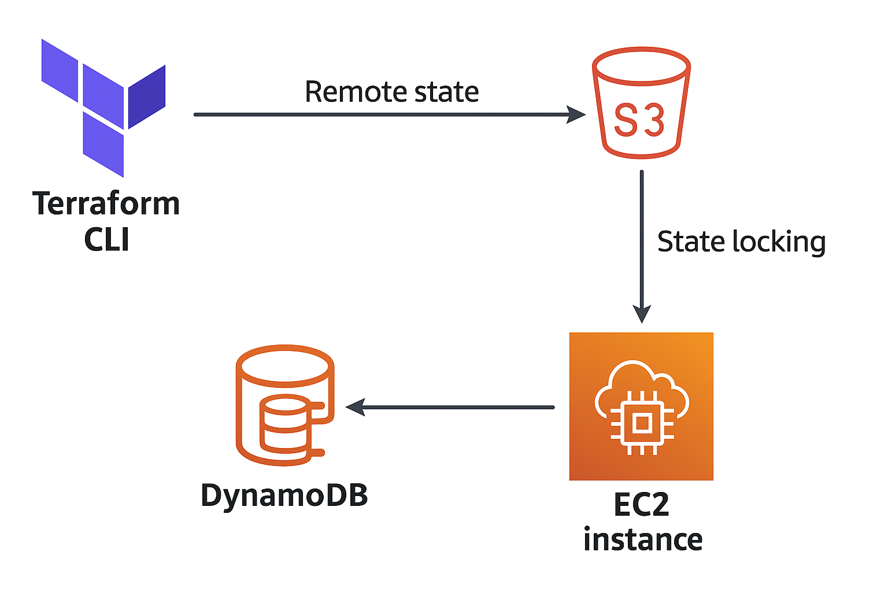
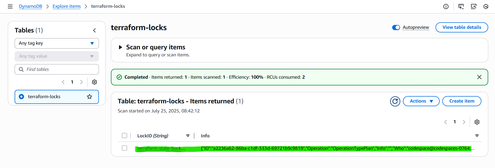
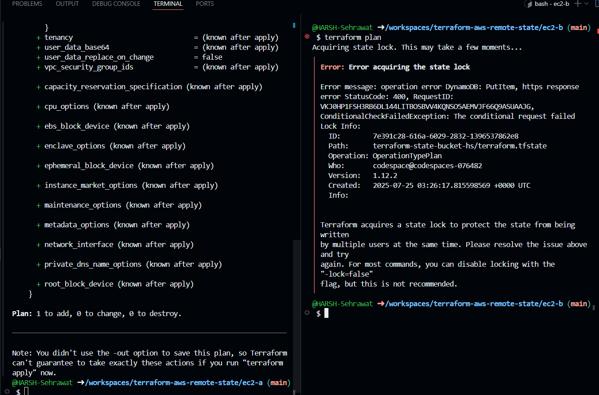

# Terraform AWS Remote State with EC2 Modules

This project demonstrates managing remote state in Terraform using AWS S3 and DynamoDB for state locking. It provisions two EC2 instances using a reusable Terraform module while maintaining a secure and scalable state management setup.

---

## \:file\_folder: Project Structure

```
terraform-aws-remote-state/
├── .devcontainer/                # Codespaces config
├── backend/                      # Remote backend creation
│   ├── main.tf
│   ├── variables.tf
│   └── backend.tf
├── ec2-a/                        # EC2 instance A config
│   ├── main.tf
│   ├── variables.tf
│   └── backend.tf
├── ec2-b/                        # EC2 instance B config
│   ├── main.tf
│   ├── variables.tf
│   └── backend.tf
├── modules/
│   └── EC2-instance/             # Reusable EC2 module
│       ├── main.tf
│       ├── variables.tf
│       └── output.tf
├── screenshots/                  # Terminal & AWS screenshots
├── architecture-diagram.png      # Architecture diagram
├── project-diagram.png           # Project structure visual
├── .gitignore
└── README.md                     # This file
```

---

## \:hammer\_and\_wrench: Tools Used

* **Terraform** v1.8+
* **AWS** (S3, DynamoDB, EC2)
* **GitHub Codespaces** (devcontainer environment)

---

## \:gear: Setup Instructions

### 1. Create Remote State Infrastructure

Navigate to the `backend/` directory and apply:

```bash
terraform init
terraform apply
```

This creates:

* An S3 bucket (for remote state storage)
* A DynamoDB table (for state locking)

### 2. Configure EC2 Projects

Each EC2 project (e.g., `ec2-a`, `ec2-b`) uses a `backend.tf` like this:

```hcl
terraform {
  backend "s3" {
    bucket         = "terraform-remote-state-HARSH"
    key            = "ec2-a/terraform.tfstate"
    region         = "eu-north-1"
    dynamodb_table = "state-lock-table"
    encrypt        = true
  }
}
```

> Change `key` and `bucket` accordingly for each environment.

### 3. Deploy EC2 Instances

Navigate into each directory (`ec2-a/` and `ec2-b/`) and run:

```bash
terraform init -reconfigure
terraform apply
```

> Each EC2 instance is provisioned using the shared module from `modules/EC2-instance`.

---

## \:art: Architecture Diagram



---

## \:camera: Sample Screenshots

### 1. Remote State Setup



### 2. Terminal - Plan Output



---

## \:bookmark: Key Features

* **Reusable Modules**: One EC2 module used for both EC2-A and EC2-B.
* **Remote State Isolation**: Separate remote state for each instance.
* **State Locking**: Prevents simultaneous changes with DynamoDB.
* **Modular, Scalable Structure**

---

## \:lock: .gitignore Example

```bash
.terraform/
*.tfstate
*.tfstate.backup
.terraform.lock.hcl
*.log
*.bak
*.swp
```

> Ensure `.terraform/` and `.terraform.lock.hcl` are not pushed.

---
---

## \:white\_check\_mark: Validation

This project has been tested on AWS with multiple concurrent Terraform runs using remote locking and works as expected.

---

## \:memo: License

MIT

---

## \:link: Author

**Harsh Sehrawat**
GitHub: [HARSH-Sehrawat](https://github.com/HARSH-Sehrawat)

---

> If you like this project, give it a star! ⭐
